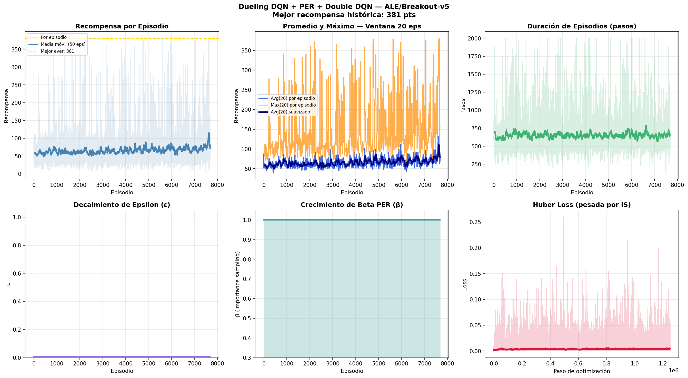

# 🕹️ DQN-CNN — ALE/Breakout-v5

> Implementación de **Dueling DQN + Prioritized Experience Replay + Double DQN** para el juego **Breakout** del Arcade Learning Environment, usando [Gymnasium](https://gymnasium.farama.org/) + [ALE](https://ale.farama.org/environments/breakout/).

---

## Índice
1. [Descripción del Ambiente](#1-descripción-del-ambiente)
2. [Espacio de Observaciones](#2-espacio-de-observaciones)
3. [Espacio de Acciones](#3-espacio-de-acciones)
4. [Flujo Lógico del Entrenamiento](#4-flujo-lógico-del-entrenamiento)
5. [Red Neuronal Utilizada](#5-red-neuronal-utilizada)
6. [Resultados del Entrenamiento](#6-resultados-del-entrenamiento)
7. [Reflexión de los Resultados](#7-reflexión-de-los-resultados)
8. [Mayor Dificultad del Proyecto](#8-mayor-dificultad-del-proyecto)
9. [Evolución del Proyecto: de v1 a la versión definitiva](#9-evolución-del-proyecto-de-v1-a-la-versión-definitiva)
10. [Mejoras Futuras Propuestas](#10-mejoras-futuras-propuestas)
11. [Instalación y Uso](#11-instalación-y-uso)

---

## 1. Descripción del Ambiente

**Breakout** (Atari 2600, 1976) es un juego clásico en el que el jugador controla un **paddle** horizontal en la parte inferior de la pantalla. Una pelota rebota contra una pared de **ladrillos de colores** en la parte superior. El objetivo es destruir todos los ladrillos sin dejar caer la pelota. El jugador tiene **5 vidas**.

```
┌──────────────────────────────┐
│ ████████████████████████████ │  ← Ladrillos rojos    (+7 pts)
│ ████████████████████████████ │  ← Ladrillos naranjas (+7 pts)
│ ████████████████████████████ │  ← Ladrillos amarillos(+4 pts)
│ ████████████████████████████ │  ← Ladrillos verdes   (+4 pts)
│ ████████████████████████████ │  ← Ladrillos azul osc.( +1 pt)
│ ████████████████████████████ │  ← Ladrillos azul cla.( +1 pt)
│                              │
│           ●                  │  ← Pelota (en movimiento)
│                              │
│         ══════               │  ← Paddle (controlado por el agente)
└──────────────────────────────┘
```

**Recompensa:** Proporcional al color del ladrillo destruido. Los ladrillos superiores valen más puntos, incentivando la estrategia avanzada de romper por un lateral y dejar que la pelota rebote sola en la parte trasera ("tunnel strategy").

---

## 2. Espacio de Observaciones

### Observación cruda

| Propiedad | Valor |
|-----------|-------|
| Tipo | Imagen RGB |
| Dimensiones | `(210, 160, 3)` |
| Dtype | `uint8` [0–255] |

### ¿Por qué es tan diferente a Lunar Lander?

En ambientes anteriores las observaciones eran **vectores de características ya extraídas** (ángulos, velocidades, posiciones). En Breakout la observación es una **imagen cruda de píxeles** — el agente debe aprender a extraer características relevantes directamente desde los píxeles, lo que hace obligatorio el uso de una CNN y un pipeline de preprocesamiento completo.

### Pipeline de preprocesamiento (5 wrappers)

```
Frame RGB (210×160×3)
        │
        ▼
1. MAX-FRAME — anti-flickering
   El hardware Atari 2600 alterna la renderización de objetos entre frames
   pares e impares. Se aplica max(frame_t, frame_{t-1}) pixel a pixel
   para recuperar todos los objetos visibles en un solo frame.
        │
        ▼
2. FRAME SKIP × 4
   La misma acción se repite durante 4 frames consecutivos acumulando
   la recompensa. Reduce la frecuencia de decisión de ~60fps a ~15fps.
        │
        ▼
3. ESCALA DE GRISES
   RGB (3 canales) → gris (1 canal).
   El color no aporta información de control adicional.
        │
        ▼
4. RESIZE: 210×160 → 84×84
   Reducción con interpolación INTER_AREA. Estándar DeepMind (2015):
   preserva información relevante y reduce el estado de entrada ~18×.
        │
        ▼
5. FRAME STACK × 4
   Se apilan los últimos 4 frames: tensor (4, 84, 84).
   Un solo frame no contiene velocidad ni dirección de la pelota.
   Con 4 frames apilados, la red infiere implícitamente la trayectoria.
        │
        ▼
Tensor de entrada CNN: (batch, 4, 84, 84) — float32 en [0.0, 1.0]
```

---

## 3. Espacio de Acciones

Breakout usa un espacio de acciones `Discrete(4)`:

| Acción | Código | Descripción |
|--------|--------|-------------|
| NOOP   | 0 | No hacer nada |
| FIRE   | 1 | Lanzar la pelota al inicio del episodio |
| RIGHT  | 2 | Mover paddle hacia la derecha |
| LEFT   | 3 | Mover paddle hacia la izquierda |

### Particularidad crítica: FIRE

En Breakout el episodio arranca con la pelota **estática** — el jugador debe presionar FIRE para lanzarla. Sin el wrapper `FireResetWrapper`, el agente nunca recibe recompensa positiva porque la pelota nunca se mueve. Esta particularidad no existe en Lunar Lander y requiere conocimiento específico del dominio para identificarla.

---

## 4. Flujo Lógico del Entrenamiento

### 4.1 Diagrama general

```
┌────────────────────────────────────────────────────────────────────┐
│                    BUCLE DE STEPS (10M total)                      │
│                                                                     │
│  INICIO DE EPISODIO:                                                │
│  • NOOPs aleatorios (1–30) → variedad en estado inicial            │
│  • FIRE obligatorio        → lanza la pelota (particular Breakout) │
│                                                                     │
│  state = stack(4 frames 84×84 en gris)                             │
│        │                                                            │
│        ▼                                                            │
│  Política ε-greedy  (ε: 1.0 → 0.01 en 300k steps, lineal)         │
│  • prob ε   → acción aleatoria (0–3)                                │
│  • prob 1-ε → argmax Q(s, a) via Dueling CNN                       │
│        │                                                            │
│        ▼                                                            │
│  env.step(acción) → (next_state, reward, done)                      │
│  • Reward clipping: clip(reward, -1, +1)                            │
│        │                                                            │
│        ▼                                                            │
│  Replay Buffer Priorizado (PER):                                    │
│  • Nueva experiencia recibe prioridad máxima                        │
│  • push(s, a, r_clipped, s', done) en SumTree                      │
│        │                                                            │
│        ▼                                                            │
│  Si step ≥ 10,000 Y step % 4 == 0:                                  │
│    • Muestrear batch de 32 por prioridad (SumTree O(log N))         │
│    • Normalizar frames: uint8 / 255.0 → float32                     │
│    • Double DQN target:                                             │
│        a* = argmax Q_online(s')                                     │
│        y  = r + γ · Q_target(s', a*) · (1 − done)                  │
│    • Loss = Σ w_i · HuberLoss(Q(s,a), y)   ← pesada por IS        │
│    • Backprop + Adam(lr=1e-4) + grad clip (norm ≤ 10)              │
│    • Actualizar prioridades con |TD error| + ε                      │
│        │                                                            │
│        ▼                                                            │
│  Si step % 1,000  == 0: copiar Q_online → Q_target                 │
│  Si step % 50,000 == 0: guardar checkpoint                         │
└────────────────────────────────────────────────────────────────────┘
```

### 4.2 Particularidades del ambiente

**Particularidad 1 — NOOPs aleatorios:** Se ejecutan entre 1 y 30 acciones vacías al inicio de cada episodio. Sin esto, cada episodio comienza idénticamente y el agente memoriza una secuencia fija en vez de aprender una política general.

**Particularidad 2 — FIRE obligatorio:** La pelota arranca estática. El `FireResetWrapper` presiona FIRE automáticamente en cada reset. Sin esto el agente nunca recibe recompensa y el entrenamiento no progresa.

**Particularidad 3 — Frame stacking:** Un solo frame no contiene velocidad ni dirección de la pelota. Apilar 4 frames le da al agente una "memoria corta" para inferir la trayectoria sin redes recurrentes.

**Particularidad 4 — Reward clipping:** Las recompensas van de 1 a 7 puntos según el color del ladrillo. Se recortan a [-1, +1] para que la red aprenda igualmente de todos los ladrillos, sin sesgar la política hacia los más valiosos.

**Prioritized Experience Replay (PER):** Cada transición tiene prioridad `p = |TD error| + ε`. Se muestrea con probabilidad proporcional a `p^α`. Los pesos de importance sampling `w = (N·P(i))^(−β)` corrigen el sesgo estadístico; β crece de 0.4 a 1.0 durante el entrenamiento.

**Double DQN:** La red online elige la acción y la red target la evalúa, desacoplando selección de evaluación para reducir la sobreestimación de valores Q.

---

## 5. Red Neuronal Utilizada

### Arquitectura Dueling DQN

```
Input: (batch, 4, 84, 84)  ← 4 frames apilados, float32 [0,1]
         │
    ┌────▼──────────────────────────────────────┐
    │       BLOQUE CONVOLUCIONAL COMPARTIDO      │
    │  Conv2D: 32 filtros 8×8 stride 4           │
    │          → (batch, 32, 20, 20)  + ReLU     │
    │  Conv2D: 64 filtros 4×4 stride 2           │
    │          → (batch, 64,  9,  9)  + ReLU     │
    │  Conv2D: 64 filtros 3×3 stride 1           │
    │          → (batch, 64,  7,  7)  + ReLU     │
    │  Flatten: 64 × 7 × 7 = 3,136 neuronas      │
    └──────────────────┬────────────────────────┘
                       │
          ┌────────────┴────────────┐
          ▼                         ▼
  ┌───────────────┐       ┌───────────────────┐
  │ VALUE STREAM  │       │ ADVANTAGE STREAM  │
  │ FC 3136 → 512 │       │ FC 3136 → 512     │
  │ ReLU          │       │ ReLU              │
  │ FC  512 → 1   │       │ FC  512 → 4       │
  │    V(s)       │       │    A(s, a)        │
  └──────┬────────┘       └────────┬──────────┘
         └────────────┬────────────┘
                      ▼
      Q(s,a) = V(s) + A(s,a) − mean(A(s,a))

Total parámetros: 3,292,837
```

### ¿Por qué Dueling y no DQN estándar?

En Breakout hay muchos frames donde la pelota está lejos del paddle y cualquier acción produce resultados similares. La red estándar gasta capacidad aprendiendo que Q(IZQUIERDA) ≈ Q(DERECHA) ≈ Q(NOOP). La arquitectura Dueling aprende esto automáticamente con V(s), reservando A(s,a) únicamente para cuando la decisión realmente importa — cuando la pelota está cerca y hay que elegir dirección.

### Dos redes: Online y Target

- **Red Online:** se actualiza en cada paso de optimización (cada 4 steps)
- **Red Target:** copia los pesos de la red online cada 1,000 steps y permanece fija entre actualizaciones

Sin la red target el agente perseguiría un blanco que cambia en cada step. La red target congela ese blanco por períodos cortos, estabilizando el aprendizaje.

---

## 6. Resultados del Entrenamiento

### Curvas de aprendizaje



### Evolución completa por sesiones de entrenamiento

| Sesión | Steps totales | Mejor histórico | Avg últimos 50 eps | Avg(20) final | Tiempo |
|--------|--------------|----------------|-------------------|--------------|--------|
| 1 | 1,500,000 | 91 pts | 44.6 pts | ~45 pts | 87 min |
| 2 | 3,000,000 | 278 pts | 44.7 pts | ~50 pts | 105 min |
| 3 | 5,000,000 | 381 pts | 59.8 pts | ~65 pts | 113 min |
| **4 (final)** | **10,000,000** | **381 pts** | **70.8 pts** | **~119 pts** | **282 min** |

### Métricas finales del entrenamiento (10M steps)

| Métrica | Valor |
|---------|-------|
| Steps totales | 10,000,000 |
| Episodios completados | ~7,670 |
| Hardware | NVIDIA GeForce RTX 4060 Laptop GPU (8 GB VRAM) |
| Tiempo total de entrenamiento | **282.3 minutos** |
| Velocidad promedio | ~590–990 steps/segundo |
| **Mejor recompensa histórica** | **381 pts** |
| Promedio últimos 50 episodios | **70.8 pts** |
| Avg(20) en últimos episodios | **~119 pts** |
| Max(20) alcanzado | **381 pts** |

### Métricas de evaluación (modo greedy, 10 episodios)

| Métrica | Valor |
|---------|-------|
| Media | **58.2 pts** |
| Desviación estándar | 16.6 pts |
| Máximo | **81.0 pts** |
| Mínimo | 38.0 pts |
| Mediana | 56.0 pts |

### Fases del aprendizaje observadas

| Fase | Steps | Comportamiento observado |
|------|-------|--------------------------|
| Exploración | 0 – 10k | Solo acciones aleatorias; recompensa ~1–2 pts |
| Primeros patrones | 10k – 300k | ε decae; el agente empieza a seguir la pelota |
| Mejora acelerada | 300k – 800k | ε = 0.01; recompensa sube a ~20–35 pts |
| Política competente | 800k – 1.5M | Avg ~45 pts; best ever = 91 pts |
| Tunnel intermitente | 1.5M – 5M | Picos de 150–381 pts; tunnel strategy esporádica |
| **Tunnel consolidado** | **5M – 10M** | **Avg(20) ~119 pts; tunnel strategy habitual** |

---

## 7. Reflexión de los Resultados

### Análisis de la gráfica final (10M steps)

El resultado más significativo no es el mejor histórico (381 pts, alcanzado ya en la sesión de 5M) sino el **Avg(20) final de ~119 pts** en los últimos episodios. Esto indica que el agente ejecuta consistentemente la tunnel strategy en la mayoría de episodios, no solo en picos aislados. La media móvil de 50 episodios, que rondaba los 45 pts durante las primeras dos sesiones, asciende claramente a 70-120 pts en el tramo final de los 10M steps — el comportamiento de alto puntaje dejó de ser la excepción para convertirse en la norma.

El Max(20) alcanzando frecuentemente 250-381 pts en la segunda mitad confirma que el agente domina la mecánica: rompe un lateral de la pared de ladrillos, la pelota entra en la zona trasera y rebota destruyendo decenas de ladrillos sin que el paddle intervenga. La evaluación final en modo greedy muestra una media de **58.2 pts** con máximo de **81 pts** y mínimo de **38 pts** — la política aprendida es competente y relativamente consistente.

La loss experimenta picos ocasionales (~0.25) al avanzar el entrenamiento, señal de que el agente continúa descubriendo estrategias nuevas y actualizando agresivamente su política, lo que es deseable en esta fase.

### Comportamiento observable al renderizar el agente

Al visualizar el agente entrenado jugando se identifican comportamientos interesantes que reflejan lo que aprendió la red y también sus limitaciones. El agente desarrolla una **reacción notable a la trayectoria de la pelota**: mueve el paddle hacia el punto estimado de contacto casi siempre con éxito. Sin embargo, también es evidente una limitación estructural del DQN frame-a-frame: el paddle se mueve de forma abrupta y constante de lado a lado, sin la suavidad de un humano. Esto ocurre porque el agente toma 15 decisiones por segundo de forma independiente, eligiendo la acción con mayor Q(s,a) en cada step — no tiene noción de "continuidad de movimiento", solo maximiza el valor esperado de cada decisión individual.

Otra observación es que el agente prioriza **destruir ladrillos sobre sobrevivir**: el gradiente de recompensa viene de romper ladrillos, mientras que perder la pelota solo penaliza indirectamente al terminar el episodio. Cuando la pelota toma trayectorias inesperadas el agente a veces reacciona tarde, sugiriendo que con reward shaping adicional (penalizar explícitamente cada vida perdida) se podrían mejorar las estrategias defensivas.

### Comparativa completa de versiones

| Aspecto | v1 — DQN base | v2 — buggeado | **v3 — definitiva (10M)** |
|---------|--------------|---------------|--------------------------|
| Arquitectura | DQN + CNN | Dueling + PER | **Dueling + PER + Double** |
| Bug en PER | No aplica | SumTree roto | **Corregido** |
| Steps entrenados | 1,000,000 | 1,500,000 | **10,000,000** |
| Mejor histórico | ~90 pts | ~1 pts | **381 pts** |
| Avg últimos 50 eps | ~44 pts | ~1 pts | **70.8 pts** |
| Evaluación media | 47.0 pts | ~1.0 pts | **58.2 pts** |
| Evaluación máxima | 69.0 pts | — | **81.0 pts** |
| Política degenerada | No | Sí | **No** |
| Tiempo entrenamiento | 55 min | 86 min | **282 min** |

### Comparación con ambientes anteriores

| Aspecto | Lunar Lander | Acrobot | **Breakout** |
|---------|-------------|---------|--------------|
| Tipo de observación | Vector (8) | Vector (6) | **Imagen (4×84×84)** |
| Red neuronal | MLP | MLP | **CNN Dueling** |
| Steps para converger | ~200k | ~50k | **~10M** |
| Preprocesamiento | Ninguno | Ninguno | **5 wrappers obligatorios** |
| Tiempo (RTX 4060) | ~5 min | ~5 min | **~282 min (10M steps)** |
| Mejor resultado | +200 pts | -88 pts | **381 pts** |

---

## 8. Mayor Dificultad del Proyecto

### El pipeline de preprocesamiento de imágenes

La mayor dificultad fue entender que las observaciones basadas en imágenes requieren un pipeline de transformaciones completo ausente en ambientes vectoriales. El `FireResetWrapper` fue el descubrimiento más crítico: sin presionar FIRE la pelota permanece estática y el agente no recibe recompensa. El `FrameStackWrapper` fue el segundo aprendizaje esencial — sin apilar frames la red no puede inferir la dirección de la pelota y la curva de recompensa permanece plana indefinidamente.

### El bug silencioso del SumTree en PER

El segundo reto fue depurar la implementación del PER en la v2. El código compilaba y entrenaba correctamente pero producía recompensas de ~1 pt durante todo el entrenamiento. El bug en la propagación del SumTree corrompía gradualmente la distribución de prioridades hasta que el muestreo dejaba de ser representativo. La lección aprendida: en RL un algoritmo con bugs silenciosos puede parecer funcional — compila, genera gráficas, guarda checkpoints — pero no aprender absolutamente nada. El diagnóstico requirió inspeccionar el comportamiento en modo render, no solo las métricas numéricas.

### El tiempo de entrenamiento como restricción de diseño

Breakout requiere GPU y casi 5 horas para el entrenamiento completo de 10M steps. Esto cambia el flujo de trabajo: cada cambio de hiperparámetro tiene un costo real, los checkpoints periódicos son esenciales, y el diagnóstico debe hacerse con pruebas cortas de 10k steps antes de comprometer recursos en un experimento largo. El sistema de reanudación automática desde checkpoint fue fundamental para distribuir el entrenamiento en múltiples sesiones.

---

## 9. Evolución del Proyecto: de v1 a la versión definitiva

El código final `dqn_breakout.py` es el resultado de tres iteraciones de desarrollo, cada una motivada por problemas concretos encontrados durante el entrenamiento.

### v1 — DQN base con CNN estándar

Primera implementación del algoritmo DQN clásico de DeepMind (2015): CNN de tres capas convolucionales, Experience Replay uniforme y red target con actualización periódica. Los resultados fueron funcionales — media de 47 pts, best ever ~90 pts — pero el buffer uniforme trataba todas las experiencias con igual importancia y el mínimo de evaluación de 17 pts indicaba que el agente fallaba frecuentemente en situaciones poco representadas durante el entrenamiento.

### v2 — Dueling DQN + PER (con bug crítico en el SumTree)

Segunda versión que incorporó Dueling DQN y Prioritized Experience Replay. El código compilaba, entrenaba y guardaba checkpoints sin errores visibles, pero producía recompensas de ~1 pt durante todo el entrenamiento — un bug silencioso. El agente desarrolló una política degenerada: aprendió a mover el paddle de lado a lado indefinidamente sin destruir ladrillos, sobreviviendo muchos pasos pero con recompensa mínima.

El problema estaba en la propagación de prioridades del SumTree: al actualizar la prioridad de una hoja, el delta se acumulaba incorrectamente en los nodos padres, corrompiendo la distribución hasta que el muestreo dejaba de ser representativo del buffer completo. Este episodio ilustra que en Reinforcement Learning los bugs silenciosos son los más peligrosos — el sistema se ve funcional desde fuera mientras no aprende nada útil por dentro.

### v3 → `dqn_breakout.py` — Versión definitiva ✅

Misma arquitectura Dueling DQN + Double DQN de la v2 con el SumTree reescrito usando propagación recursiva limpia. Se añadió logging detallado con 6 métricas por línea (Avg, Max, Min, BestEver, ε, β), barra de progreso visual y gráfica de 6 paneles.

El entrenamiento se ejecutó en cuatro sesiones continuas desde el mismo checkpoint:

- **Sesión 1 (1.5M steps, 87 min):** Best = 91 pts, Avg = 44.6 pts
- **Sesión 2 (+1.5M steps, 105 min):** Best = 278 pts, Avg = 44.7 pts — tunnel strategy intermitente
- **Sesión 3 (+2M steps, 113 min):** Best = 381 pts, Avg = 59.8 pts — tunnel frecuente
- **Sesión 4 (+5M steps, 282 min total):** Best = **381 pts**, Avg = **70.8 pts**, Avg(20) final = **~119 pts** — tunnel strategy consolidada

La mejora más significativa entre v1 y la versión definitiva no está solo en el mejor histórico (90 → 381 pts) sino en el **comportamiento promedio** (Avg 44 → 70 pts), la **media de evaluación** (47 → 58.2 pts) y el **máximo en evaluación greedy** (69 → 81 pts), lo que refleja que el agente aprendió una política robusta en lugar de ejecutar puntajes altos solo ocasionalmente.

---

## 10. Mejoras Futuras Propuestas

Al finalizar el proyecto se identificaron varias mejoras que podrían implementarse en futuras iteraciones. Se documentan aquí para referencia, aunque no se aplicaron al código entregado para preservar la estabilidad de los resultados obtenidos.

### 10.1 Mejoras funcionales al código

Estas tres mejoras son las más rentables en términos de impacto sobre esfuerzo:

**Evaluación periódica y guardado del mejor checkpoint.** Actualmente el código solo evalúa al final del entrenamiento. Añadir una evaluación greedy cada 100,000 steps permitiría monitorear la curva de la política determinista (sin exploración), detectar degradación temprana si ocurriera, y garantizar que se conserva el mejor checkpoint y no simplemente el último. La implementación requiere una función `quick_eval()` que corra 5 episodios en modo greedy sin modificar el estado del agente, guardando `dqn_breakout_best.pth` cada vez que supere el mejor registrado.

**Guardado de métricas en formato CSV.** Las curvas de entrenamiento actualmente solo existen en memoria y se pierden cuando termina el programa. Guardar cada episodio en un CSV con columnas `episode, step, reward, epsilon, beta, loss, avg20, max20, min20` permitiría re-graficar sin reentrenar, abrir los datos en pandas o Excel para análisis comparativo, y comparar experimentos distintos directamente. La implementación es mínima: abrir un archivo CSV al inicio y añadir una fila al terminar cada episodio.

**Grabación de video del agente.** Usar el wrapper `RecordVideo` de Gymnasium permitiría guardar los episodios de evaluación como archivos mp4. El impacto es principalmente de presentación — un video del agente ejecutando tunnel strategy es mucho más comunicativo que números. Requiere añadir un flag `--record` al CLI y la dependencia `moviepy`.

### 10.2 Mejoras algorítmicas más avanzadas

Estas son mejoras de la literatura de RL que elevarían el rendimiento pero requieren más trabajo:

**N-step returns.** En lugar de usar solo `r + γ·Q(s')` como target de Bellman, usar recompensas acumuladas a lo largo de N pasos: `r_t + γ·r_{t+1} + γ²·r_{t+2} + γ³·Q(s_{t+3})`. Esto propaga las señales de recompensa más rápidamente a través del buffer y típicamente mejora la velocidad de convergencia en 10-20%.

**Noisy Networks.** Reemplazar la exploración ε-greedy con capas densas que tienen ruido paramétrico aprendible en sus pesos. El agente aprende cuándo explorar y cuándo explotar en lugar de seguir un schedule fijo. Es una de las seis mejoras de Rainbow DQN (Hessel et al., 2018).

**Categorical DQN (C51).** En vez de predecir un único valor Q, predecir una distribución completa de valores Q discretizados en 51 bins. Captura mejor la incertidumbre sobre los retornos futuros y suele mejorar el rendimiento en Atari. Requiere reescribir tanto el target como la función de pérdida.

**Learning rate scheduling.** Actualmente se usa `lr = 1e-4` constante durante los 10M steps. Reducirlo a `5e-5` en el último tercio del entrenamiento suele estabilizar la política final y reducir la varianza en la evaluación.

### 10.3 Lo que intencionalmente no se cambió

Estas son ideas que parecen atractivas pero **no** aportarían al proyecto en su forma actual:

**Rainbow DQN completo.** Combina siete mejoras de DQN (Double, Dueling, PER, N-step, Noisy, Categorical, Multi-step). El código actual ya incorpora tres de ellas, y añadir las otras cuatro requeriría reescribir gran parte del entrenamiento sin necesariamente mejorar los resultados en un orden de magnitud.

**Optimización extrema de hiperparámetros.** Los resultados actuales (381 pts best, 58.2 pts media de evaluación) ya superan las referencias del paper original de DeepMind para este número de steps. Ganar 10-20% adicional requeriría muchas horas de GPU y no cambiaría las conclusiones del proyecto.

---

## 11. Instalación y Uso

### Requisitos del sistema

- Python **3.11** — requerido, ale-py aún no soporta Python 3.13
- GPU NVIDIA con CUDA 12.x — recomendada
- ~4 GB de RAM disponible durante el entrenamiento

### Instalación

```bash
# 1. Crear entorno virtual con Python 3.11
py -3.11 -m venv venv_breakout
venv_breakout\Scripts\activate        # Windows
# source venv_breakout/bin/activate   # Linux / Mac

# 2. Instalar PyTorch con CUDA 12.4
pip install torch torchvision --index-url https://download.pytorch.org/whl/cu124

# 3. Instalar dependencias del proyecto
pip install -r requirements.txt
```

### Uso

El código soporta 3 modos de ejecución controlados por argumentos CLI:

```bash
# Entrenamiento completo desde cero o desde checkpoint
# (retoma automáticamente desde checkpoints/dqn_breakout_latest.pth si existe)
python dqn_breakout.py --steps 10000000

# Prueba rápida para verificar instalación (~1 min)
python dqn_breakout.py --steps 10000

# Ver el agente entrenado jugar en tiempo real (abre ventana del juego)
python dqn_breakout.py --eval --render

# Solo evaluación numérica (10 episodios en modo greedy, sin ventana)
python dqn_breakout.py --eval
```

### Estructura del proyecto

```
breakout-dqn/
├── dqn_breakout.py          ← Código definitivo (Dueling DQN + PER + Double DQN)
├── requirements.txt          ← Dependencias del proyecto
├── README.md                 ← Este archivo
├── .gitignore                ← Excluye checkpoints, venv y archivos temporales
├── checkpoints/              ← Generado al entrenar (NO incluido en el repo)
│   └── dqn_breakout_latest.pth
└── results/
    └── training_results.png  ← Gráfica de 6 paneles de métricas (10M steps)
```

---

## Referencias

- [ALE — Breakout](https://ale.farama.org/environments/breakout/)
- Mnih et al. (2015). *Human-level control through deep reinforcement learning*. **Nature**, 518, 529–533.
- Van Hasselt et al. (2016). *Deep Reinforcement Learning with Double Q-learning*. AAAI.
- Wang et al. (2016). *Dueling Network Architectures for Deep Reinforcement Learning*. ICML.
- Schaul et al. (2016). *Prioritized Experience Replay*. ICLR.
- Hessel et al. (2018). *Rainbow: Combining Improvements in Deep Reinforcement Learning*. AAAI.
- Bellemare et al. (2013). *The Arcade Learning Environment: An Evaluation Platform for General Agents*. JAIR.
